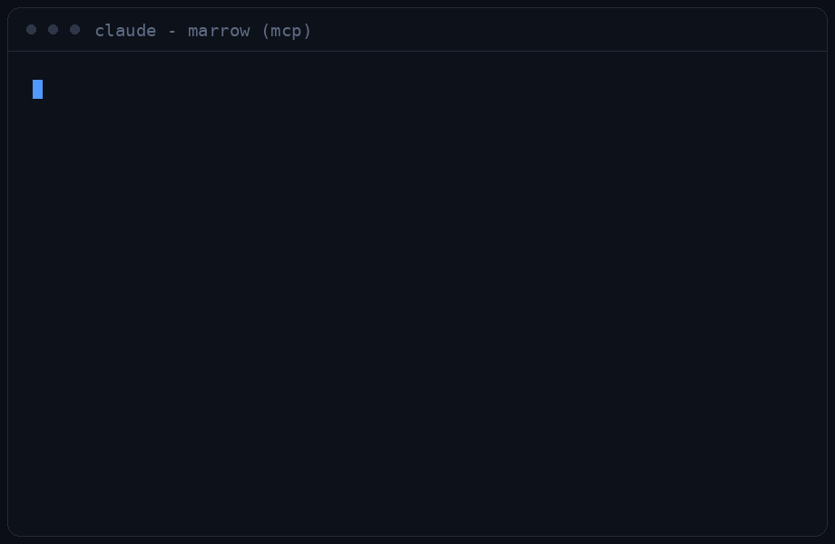

# marrow-mcp

Give your AI agents read-only access to your own Apple Health data.

[Marrow](https://skeletonarmy.tech/) is a free iOS app that pulls 174 Apple
Health metrics, your food diary and your workouts into one place. This repo is
its **self-hosted companion server**: one Python file, standard library only,
that keeps a SQLite mirror of your data on hardware you own and serves it over
the Model Context Protocol so agents can query it 24/7, phone in your pocket.

Nothing here talks to a cloud. Data flows phone → your machine, full stop.



## Run it

```sh
python3 marrow_server.py                      # prints a pairing URL
python3 marrow_server.py --port 8800 --data ./data
```

or

```sh
docker compose up -d
```

Open the pairing URL on any screen, then in Marrow: **Server → Pair with a
server → scan**. From then on the app's background pushes keep the mirror
current with the app closed.

## Connect an agent

The server speaks MCP over Streamable HTTP (JSON-RPC 2.0, protocol version
`2025-06-18`), authenticated with a bearer token it generates on first run and
prints alongside the pairing link.

**Claude Code**

```sh
claude mcp add --transport http marrow \
  http://<server-ip>:8800/mcp \
  --header "Authorization: Bearer <mcp token>"
```

**Claude Desktop, one click**

Download [`marrow.mcpb`](https://github.com/skeletonarmytech/marrow-mcp/releases/latest/download/marrow.mcpb),
double-click it, and Claude Desktop installs the extension and asks for the
URL and token. No terminal involved. (The bundle is a tiny zero-dependency
bridge in `mcpb/`; it forwards Claude's stdio to your Marrow URL and nothing
else.)

**Claude Desktop (manual), Cursor, or anything using an `mcp.json`**

```json
{
  "mcpServers": {
    "marrow": {
      "type": "http",
      "url": "http://<server-ip>:8800/mcp",
      "headers": { "Authorization": "Bearer <mcp token>" }
    }
  }
}
```

**Check it by hand**

```sh
curl -s http://<server-ip>:8800/mcp \
  -H "Authorization: Bearer <mcp token>" \
  -H "Content-Type: application/json" \
  -d '{"jsonrpc":"2.0","id":1,"method":"tools/list"}'
```

## Tools

All read-only. Nothing an agent can call writes to your health record.

| Tool | Returns |
|---|---|
| `health_summary` | Recent days across activity, heart, sleep and nutrition |
| `list_metrics` | Every metric in the mirror, with units and coverage |
| `metric_daily` | Daily values for any metric, up to 400 days |
| `metric_samples` | Raw records with timestamps and source devices |
| `workouts` | Workouts, including set-by-set strength detail |

Then ask your agent things like *"how did my sleep change once I started
training in the mornings?"* and let it go and look.

## The other three ways in

This server is one of four, and you do not need it to give agents access:

1. **On-device MCP.** Marrow runs the same MCP surface on the iPhone itself at
   `http://<phone-ip>:21212/mcp`, answering while the app is running. Richest
   data, zero extra hardware.
2. **This server.** Always-on mirror on your own box.
3. **Relay gateway.** Serves the mirror when the phone is asleep.
4. **Manual files.** CSV, JSON and GPX out of the share sheet, plus scheduled
   webhook pushes to any URL (Home Assistant, n8n, your own endpoint).

All four are in the free tier. Setup for all of them:
<https://skeletonarmy.tech/mcp>.

## Security

- Both servers are built for a LAN or a tailnet. **Do not port-forward this to
  the open internet.** If you need it remotely, front it with
  `tailscale serve`, Caddy, or an equivalent so the transport is HTTPS and the
  device is authenticated before the bearer token is ever presented.
- Two separate tokens live in `--data`: `.app-token` for the phone's pushes and
  `.mcp-token` for agents. Rotating one does not disturb the other.
- Ingest is idempotent and UUID-keyed, so a replayed batch cannot double-count.

## Status

Marrow is in TestFlight beta (0.2.0, build 85), iOS 17+, and requires Apple
Health. [Ask for an invite.](https://skeletonarmy.tech/#get)

The iOS app is closed source; this server is not, because you should be able to
read anything you are asked to run on your own hardware.

## Registry

Listed in the [official MCP registry](https://registry.modelcontextprotocol.io)
as `tech.skeletonarmy/marrow`, verified by DNS on skeletonarmy.tech.

mcp-name: tech.skeletonarmy/marrow

## Help and policies

- [Agent setup guide](https://skeletonarmy.tech/mcp), the full client-by-client
  walkthrough
- [Support and troubleshooting](https://skeletonarmy.tech/support), or email
  <support@skeletonarmy.tech>
- [Privacy policy](https://skeletonarmy.tech/privacy). Short version: your
  health data stays on your device, this server runs on hardware you own, and
  nothing here reports to us.
- [Terms of use](https://skeletonarmy.tech/terms)

## Licence

MIT. See [LICENSE](LICENSE).
